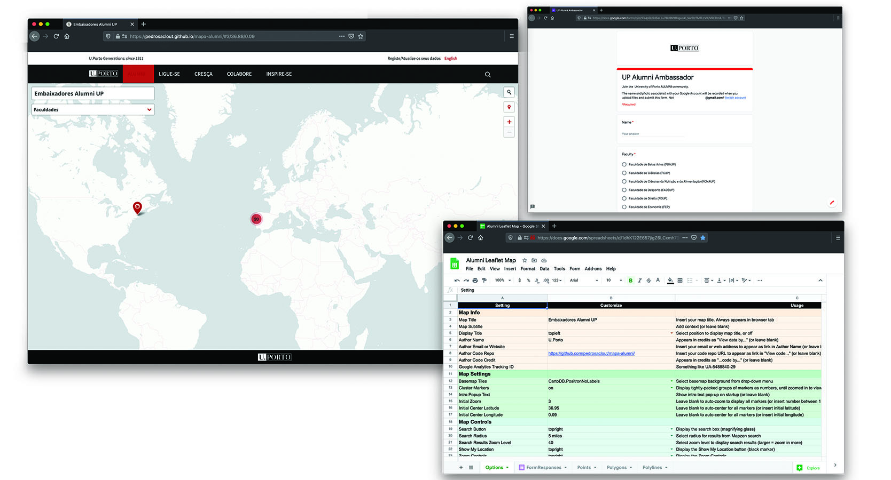

# Leaflet Maps with Google Sheets
Customize Leaflet maps with a linked Google Sheets template or CSV files and GeoJSON data on GitHub

## Live links (replace with your own)
- Leaflet Map https://pedrosaclout.github.io/mapa-alumni/
- Google Sheets template https://docs.google.com/spreadsheets/d/1dhK122E657jigZ6LCxmh73vPygRfE5v_p5knfWD5p-U/edit#gid=0

#### Geocode your address data with Google Sheets add-on
To geocode (find latitude and longitude coordinates), we recommend installing the free [Geocoding by Awesome Table add-on for Google Sheets]

#### To finalize your map, you need to:
- Get your own Google Sheets API Key to insert into `google-doc-url.js`

## Update your code
Reconnect your Google Sheet ID to the `google-doc-url.js` file in your new repo.

## Credits (and licenses)
Customized by Pedro Sá Couto (http://pedrosacouto.com/) and Rita Graça (http://ritagraca.com/) (2020), for UP.
Developed by [Ilya Ilyankou](https://github.com/ilyankou) and [Jack Dougherty](https://github.com/jackdougherty) with support from Trinity College CT.
Inspired by Code for Atlanta mapsfor.us (2016) https://github.com/codeforatlanta/mapsforus (BSD-3-Clause)

We use [Google Sheets API version 4](https://developers.google.com/sheets/api), with these open-source components:

- Leaflet v1.7.1 https://leafletjs.com (BSD-2-Clause)
- jQuery v3.5.1 https://code.jquery.com (MIT)
- PapaParse v5.3.0 to parse CSV with JavaScript (MIT)
- Font Awesome (v4.7) https://cdn.fontawesome.com (MIT, SIL OFL 1.1)
- leaflet-providers (v1.10.2) https://github.com/leaflet-extras/leaflet-providers (BSD-2-Clause)
- Leaflet.awesome-markers (v2.0.4), manually updated to svg to allow hex and material icons https://github.com/sigma-geosistemas/Leaflet.awesome-markers (MIT)
- Leaflet.markercluster (v1.4.1) https://github.com/Leaflet/Leaflet.markercluster (MIT)
- Leaflet.MarkerCluster.LayerSupport (v.2.0.1) https://github.com/ghybs/Leaflet.MarkerCluster.LayerSupport (MIT)
- Leaflet Control Geocoder v1.13.0 https://github.com/perliedman/leaflet-control-geocoder (BSD 2-Clause)
- leaflet-locatecontrol (v0.72.0) https://github.com/domoritz/leaflet-locatecontrol (MIT)
- jQuery-CSV (v1.0.11) https://github.com/evanplaice/jquery-csv (MIT)
- DataTables (v1.10.22) by SpryMedia Ltd. https://datatables.net (MIT)
- Material icons https://material.io/resources/icons/ (Apache)
- Single Element CSS Spinner (31 May 2016) https://github.com/lukehaas/css-loaders (MIT)
- Google Colour Palette Generator (2015) https://github.com/google/palette.js (MIT)
- polylabel (Dec. 2016 customized) https://github.com/mapbox/polylabel to optimally place text labels in a polygon (ISC), with TinyQueue (v1.1.0) (https://github.com/mourner/tinyqueue), polylabel's dependency (ISC)

## Create your own
See step-by-step tutorial in *Hands-On Data Visualization* https://handsondataviz.org/leaflet-maps-with-google-sheets.html
Check the master branch for amazing documentation
